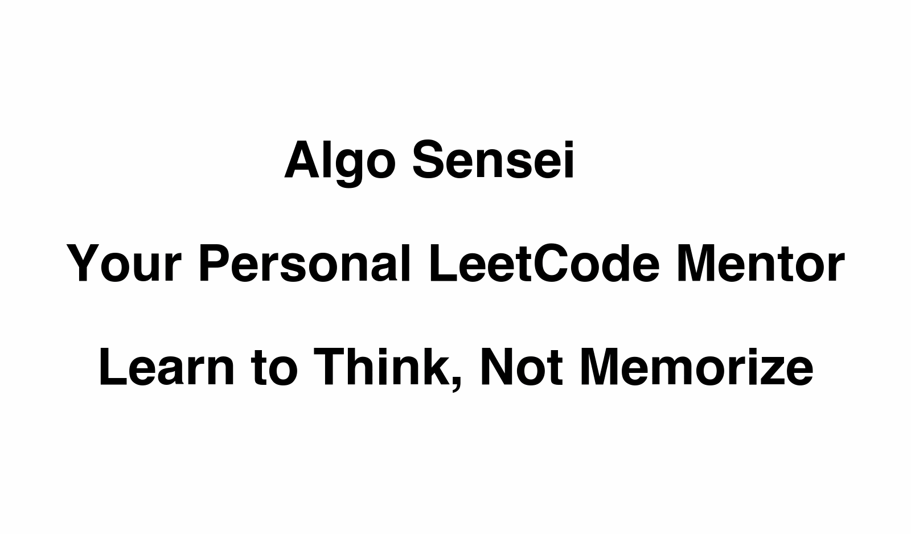

<div align="center">

# Algo Sensei 🥋

**Your Personal LeetCode & DSA Mentor**

Master algorithms through intelligent guidance, not just solutions.



[](https://claude.ai/code)
[](LICENSE)
[](CONTRIBUTING.md)

</div>

**Algo Sensei** is an intelligent Claude Code skill that transforms how you practice LeetCode and master Data Structures & Algorithms. Instead of just giving you answers, it **teaches you to think** like a senior engineer.

## Why Algo Sensei?

Traditional LeetCode practice has a problem: **Copy-pasting solutions doesn't build problem-solving skills.**

Algo Sensei is different:
- ✅ **Teaches patterns** instead of memorizing solutions
- ✅ **Progressive hints** that guide you without spoiling
- ✅ **Real interview simulation** with feedback
- ✅ **Intelligent mode detection** - adapts to what you need
- ✅ **Pattern recognition training** - see problems like pros do

## Features

### 🎓 Tutor Mode
Get foundational understanding through:
- Clear concept explanations with examples
- Step-by-step problem breakdowns
- Visual diagrams (ASCII art)
- Building intuition, not just memorization

### 💡 Hint Mode (The Secret Weapon)
5-level progressive hint system:
1. Observation hints (gentlest)
2. Pattern recognition nudges
3. Approach direction
4. Specific technique reveal
5. Pseudocode skeleton (last resort)

**You learn 10x more** when you discover the solution yourself with guidance.

### 🔍 Review Mode
Comprehensive code review covering:
- Correctness verification
- Time & space complexity analysis
- Code quality feedback
- Optimization opportunities
- Edge case identification
- Interview readiness assessment

### 🎤 Interview Mode
Realistic mock interviews with:
- Professional interviewer roleplay
- Real-time feedback and hints
- Communication evaluation
- Detailed performance rubric
- Post-interview improvement plan

### 🗺️ Pattern Mapper Mode
Learn to recognize algorithmic patterns dynamically:
- Teaches HOW to identify patterns, not just memorize them
- Draws on Claude's comprehensive knowledge of ALL patterns
- Builds transferable pattern-recognition skills
- Works with any pattern: Two Pointers, DP, Graphs, Monotonic Stack, and more

**Stop solving random problems. Start recognizing patterns.**

## Installation

### For Claude Code Users (Recommended)

**Option 1: Install to personal skills (available in all projects)**

```bash
# Clone the repository
git clone https://github.com/karanb192/algo-sensei.git

# Copy to your personal Claude skills directory
cp -r algo-sensei ~/.claude/skills/

# Restart Claude Code
```

**Option 2: Install to project (team-shared via git)**

```bash
# Clone the repository
git clone https://github.com/karanb192/algo-sensei.git

# Copy to your project's Claude skills directory
cp -r algo-sensei /path/to/your/project/.claude/skills/

# Commit to git so your team gets it too!
git add .claude/skills/algo-sensei
git commit -m "Add Algo Sensei skill for DSA practice"
```

### For Claude.ai Users

Algo Sensei works great on Claude.ai too! Here's how:

**Method 1: Project Knowledge (Recommended - Full Experience)**

1. Go to [Claude.ai](https://claude.ai) and create a new Project
2. Click "Add content" → Upload files
3. Upload these key files for full functionality:
   - `SKILL.md` (main skill)
   - All files from `modes/` folder (5 files)
   - `docs/dsa-cheatsheet.md` (optional but helpful)
   - `templates/solutions/solution-template.md` (for structured solutions)
4. All conversations in this project now have full Algo Sensei capabilities!

**Method 1b: Quick Setup (SKILL.md only)**

For a lighter setup, just upload `SKILL.md` - you'll get intelligent routing but won't have access to the detailed mode instructions.

**Method 2: Copy Specific Modes**

1. Browse to the mode you need (e.g., `modes/hint-mode.md`)
2. Copy the entire content
3. Paste it as your first message in a new conversation
4. Continue with your DSA problem

**Method 3: Manual Integration**

If you have Claude Pro with custom instructions:
1. Add shortened version of `SKILL.md` to your custom instructions
2. Algo Sensei will be available in all chats

> **Tip:** Project Knowledge with all files uploaded gives you the full experience - Claude can access all modes, patterns, and templates just like in Claude Code!

## Quick Start

Once installed, Algo Sensei automatically activates when you need help with DSA/LeetCode problems.

### Usage Examples

**Get hints on a problem:**
```
You: "I'm stuck on LeetCode #3 - Longest Substring Without Repeating Characters. Can you give me a hint?"

Algo Sensei: [Automatically switches to Hint Mode]
💡 Hint #1: What if you needed to track which characters you've seen recently?
...
```

**Learn a concept:**
```
You: "Can you explain dynamic programming to me?"

Algo Sensei: [Automatically switches to Tutor Mode]
📚 Let's build your understanding of DP from the ground up...
```

**Review your code:**
```
You: "Here's my solution for Two Sum. Can you review it?"
[paste code]

Algo Sensei: [Automatically switches to Review Mode]
🔍 Code Review: Two Sum
...
```

**Practice interview:**
```
You: "Can we do a mock interview with a medium-level problem?"

Algo Sensei: [Automatically switches to Interview Mode]
🎤 Hi! I'm Alex, senior engineer at TechCo. Ready to start?
...
```

**Identify pattern:**
```
You: "I'm not sure what approach to use for this problem..."

Algo Sensei: [Automatically switches to Pattern Mapper Mode]
🗺️ Let me help you identify the pattern...
```

## Pattern Recognition Training

Instead of memorizing fixed templates, Algo Sensei teaches you to recognize patterns dynamically:

- **Signal keyword detection** - Learn to spot clues in problem statements
- **Problem characteristic analysis** - Identify data structures and constraints
- **Pattern matching skills** - Build intuition for which approach fits
- **Comprehensive explanations** - Understand any algorithmic pattern Claude knows

Works for all patterns: Two Pointers, Sliding Window, DP, Graphs, Heaps, Tries, Monotonic Stack, and more!

## What Makes This Different?

### vs. LeetCode Premium
- ✅ Free and open-source
- ✅ Personalized teaching style
- ✅ Deeper explanations
- ✅ Pattern-focused approach

### vs. ChatGPT/Claude prompts
- ✅ Specialized for DSA/interviews
- ✅ Structured progressive learning
- ✅ Intelligent mode switching
- ✅ Consistent methodology

### vs. YouTube tutorials
- ✅ Interactive and personalized
- ✅ Adapts to your skill level
- ✅ Available 24/7
- ✅ Covers YOUR specific problems

## File Structure

```
algo-sensei/
├── SKILL.md                          # Main skill file (intelligent router)
├── README.md                         # You are here
├── modes/
│   ├── tutor-mode.md                # Concept explanations
│   ├── hint-mode.md                 # Progressive hints
│   ├── review-mode.md               # Code review
│   ├── interview-mode.md            # Mock interviews
│   └── pattern-mapper-mode.md       # Pattern recognition
├── templates/
│   └── solutions/
│       └── solution-template.md     # Multi-language solution format
├── scripts/
│   └── [future: test generators, complexity analyzers]
└── docs/
    └── dsa-cheatsheet.md            # Quick reference
```

## Philosophy

Algo Sensei is built on research-backed learning principles:

1. **Socratic Method**: Learn through questions, not lectures
2. **Progressive Disclosure**: Start simple, add complexity gradually
3. **Pattern Recognition**: Master frameworks, not individual problems
4. **Deliberate Practice**: Struggle productively with guidance
5. **Metacognition**: Understand your thinking process

**The goal isn't solving 1000 problems. It's building the mental framework to solve ANY problem.**


## Roadmap

- [x] Core 5 modes (Tutor, Hint, Review, Interview, Pattern Mapper)
- [x] Dynamic pattern recognition (leverages Claude's full knowledge)
- [x] Multi-language support (Python, Java, C++, JavaScript, Go, etc.)
- [ ] Interactive visualization scripts
- [ ] Complexity analyzer tool
- [ ] Test case generator
- [ ] Spaced repetition integration
- [ ] Progress tracking across sessions

## Contributing

We welcome contributions! See [CONTRIBUTING.md](CONTRIBUTING.md) for guidelines.

**Ideas for contributions:**
- Improve mode instructions based on user feedback
- Add more language-specific examples
- Create automation scripts (test generators, complexity analyzers)
- Bug fixes and improvements
- Documentation enhancements

## FAQ

**Q: Do I need Claude Code to use this?**
A: Algo Sensei works best with Claude Code, but you can use individual mode files as prompts in Claude.ai.

**Q: Is this better than LeetCode Premium?**
A: Different purposes. Algo Sensei teaches you HOW to think. LeetCode Premium gives you solutions. Use both!

**Q: Can this help me pass FAANG interviews?**
A: Yes! Interview Mode simulates real interview conditions, and Pattern Mapper teaches the frameworks used in top companies.

**Q: I'm a complete beginner. Is this for me?**
A: Absolutely! Tutor Mode is designed for beginners. Algo Sensei adapts to your level.

**Q: Does it support languages other than Python?**
A: Yes! Algo Sensei supports all major programming languages (Python, JavaScript, Java, C++, Go, TypeScript, Rust, etc.). Just specify your preferred language and Claude will adapt accordingly.

## License

MIT License - See [LICENSE](LICENSE) file for details.

## Acknowledgments

- Built for [Claude Code](https://claude.ai/code) by Anthropic
- Inspired by the [LeetCode](https://leetcode.com) community
- Pattern frameworks from [NeetCode](https://neetcode.io), [AlgoMonster](https://algo.monster), and interview experience

## Connect

- ⭐ Star this repo if Algo Sensei helped you!
- 🐛 Report issues via GitHub Issues
- 💡 Suggest features via GitHub Discussions
- 🐦 Share your success: `#AlgoSensei`

---

**Ready to level up your DSA game?** Install Algo Sensei and master patterns, not just problems. 🥋

Made with ❤️ for developers preparing for their dream roles.
